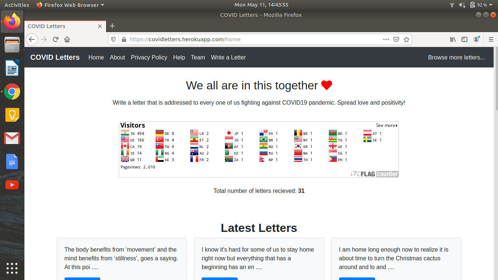

## COVID Letters: Spreading positivity in the age of COVID 

---
COVID Letters is a platform where every one of us can write anonymous letters to spread love and positivity, and help others combat loneliness and anxiety during this pandemic. Writing letters is the best way to show support for each other, spread hope, and send prayers. As you write letters, you will be helping a lot of people to stay positive and feel better. When in need of some love and positivity, you can come here to read letters contributed by others. 

---
### Tech stack
- Bootstrap 
- Nodejs 
- MongoDB 
- Hosted on Heroku

---

Note: If you find any bug or wish to propose any new feature or want to make the platform look better, please consider starting an issue or a PR. 
